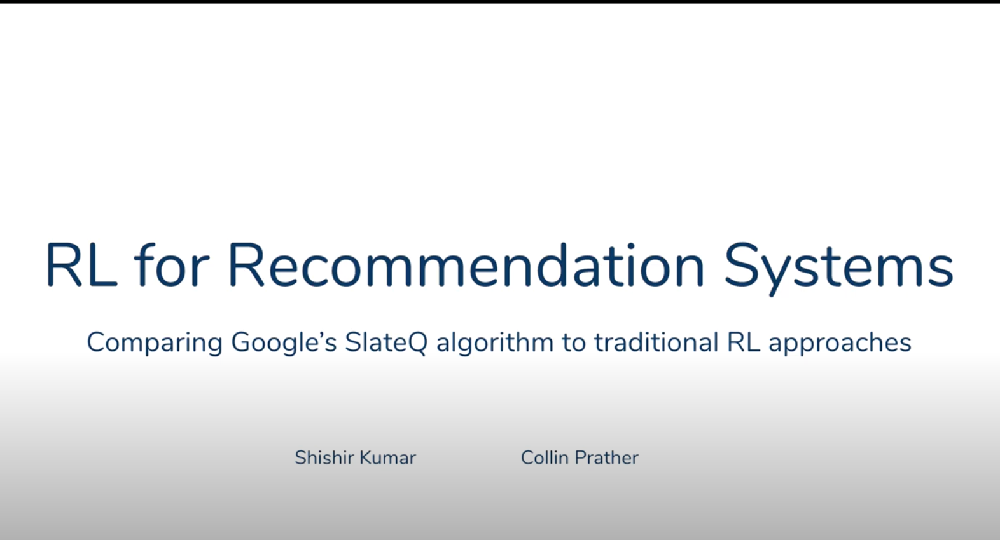

# Reinforcement Learning for Recommender Systems

## Summary 

Most practical recommender systems focus on estimating immediate user engagement without considering the long-term effects of recommendations on user behaviour. Reinforcement learning (RL) methods offer the potential to optimize recommendations for long-term user engagement. However, since users are often presented with slates of multiple items—which may have interacting effects on user choice—methods are required to deal with the combinatorics of the RL action space.

Google’s​ [SlateQ](https://research.google/pubs/pub48200/) algorithm addresses this challenge by decomposing the long-term value (LTV) of a slate into a tractable function of its component item-wise LTVs. In this repo, we compare the efficiency of SlateQ to other RL methods like Q-learning that don’t decompose the LTV of a slate into its component-wise LTVs.

## Environment

Here, we explore the interest evolution environment from [`RecSim`](https://ai.googleblog.com/2019/11/recsim-configurable-simulation-platform.html) ([GitHub repo](https://github.com/google-research/recsim)) library to train RL agents.

## Important Links

1. [Problem Formulation Document](https://github.com/collinprather/SlateQ/blob/master/project_proposal.pdf)
2. [Exploratory Notebook on the interest evolution environment](https://github.com/collinprather/SlateQ/blob/master/notebooks/baseline_agents.ipynb)
3. [Notebook comparing RL techniques](https://github.com/collinprather/SlateQ/blob/master/notebooks/baseline_agents.ipynb)
4. [Presentation](https://docs.google.com/presentation/d/1VqM9oZTlmJTSrctpoUE7FIX_SZyDKCh6ex3zFkil21g/edit?usp=sharing)

## Contributors

[Collin Prather](https://www.linkedin.com/in/collin-prather/) and [Shishir Kumar](https://www.linkedin.com/in/shishir-kumar/) are Master students in Data Science at the University of San Francisco.

Thanks to [Prof Brian Spiering](https://www.linkedin.com/in/brianspiering/) for introducing us to this wonderful world of RL.

---

As governed by the `recsim` library, this repo uses Python 3.6.
